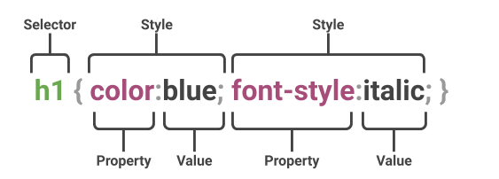

#What is ***CSS

CSS stands for *Cascading* Style Sheets
CSS describes how HTML elements are to be displayed on screen, paper, or in other media.
CSS is also used to save time and saves alot of work. It can control the layout of multiple web pages all at once.
CSS is used to define styles for your web pages, including the design, layout and variations in display for different devices and screen sizes.
CSS is a rule-based language — you define the rules by specifying groups of styles that should be applied to particular elements or groups of elements on your web page.
{} are used instead of HTML's <> tags

## Example

